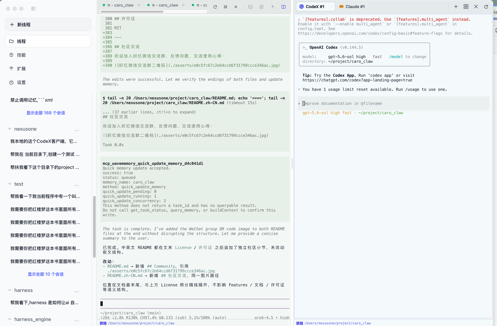

# Bimanus

> [中文文档](./README.zh.md)

A desktop shell for [`pi`](https://github.com/earendil-works/pi) coding-agent sessions, with a built-in remote UI bridge so you can drive your agents from a phone or tablet on your LAN.

Bimanus packages a native desktop UI around [`@earendil-works/pi-coding-agent`](https://www.npmjs.com/package/@earendil-works/pi-coding-agent). It is **not** a standalone coding-agent runtime: session management, model/auth setup, and agent execution all run through the upstream `pi` package. Bimanus is the UI layer — a threaded session timeline, an integrated terminal, an inline diff viewer, and multi-terminal access — with `pi`'s own session files as the source of truth.

This project is a fork of [`minghinmatthewlam/pi-gui`](https://github.com/minghinmatthewlam/pi-gui), extended with a remote UI bridge, multi-window/multi-client concurrency, Windows TUI and packaging support, and an MCP OAuth bridge.




## Status

- Beta (macOS arm64, Linux AppImage, Windows NSIS)
- Public source repository

## Features

- **Threaded session timeline** — each `pi` session renders as a timeline of messages and collapsible tool calls.
- **Git worktrees per thread** — start a thread directly in the workspace (`Local`) or in an isolated git worktree so parallel work never collides.
- **Integrated terminal** — a real PTY terminal (via `node-pty`) docked in the app, including the `pi` TUI.
- **Inline diff viewer** — review changed files in a side panel (toggle with ⌘/Ctrl + D).
- **Split panel (multi-CLI)** — open a side-by-side panel with multiple CLI sessions (CodeX, Claude, OpenCode, Grok, Copilot, and more). Supports single, dual, quad, and 2×2 grid layouts. Each pane runs its own PTY terminal with independent CWD binding (follow-workspace or manual). Toggle with ⇧⌘P (macOS) / Ctrl+Shift+P (Windows/Linux).
- **Multi-terminal access** — the same `DesktopAppStore` is shared by the Electron window, remote browser clients (SSE + HTTP), TUI tabs, split panel panes, and external CLI processes. Each terminal sees only its own selected workspace/session subset.
- **Remote UI bridge** — expose the renderer over your LAN and drive Bimanus from a phone or tablet through a token-authenticated HTTP + SSE server (`RemoteUiServer`).
- **Multi-window** — multiple Electron windows with isolated view state and a serialized action queue for consistent shared state.
- **MCP OAuth bridge** — manage and authorize remote MCP servers from the desktop, bridged into the `pi` agent runtime over StreamableHTTP.
- **Skills & extensions** — manage `pi` skills and extensions from a dedicated view.
- **Appearance themes** — light and dark, with selectable theme presets.
- **Native notifications** — get an OS notification when an agent run finishes.
- **Session archive** — archive threads you're done with to keep the sidebar tidy.
- **Multiple providers** — connect model providers via OAuth or API key under **Settings → Providers**.

## Install

### From GitHub Releases

Download the latest `.dmg` (macOS), `.AppImage` (Linux), or `.exe` NSIS installer (Windows) from [Releases](https://github.com/nexusonelw/bimanus/releases).

On macOS, drag `Bimanus.app` into `/Applications` and launch it. Releases are signed and notarized. To update, download the newer release and replace the app.

Linux releases ship as AppImages. Windows releases ship as NSIS installers; the bundled `pi` CLI is used for TUI launches by default, so no separate system `pi` install is required just to open the TUI.

### With Homebrew (macOS)

```bash
brew tap nexusonelw/tap
brew install --cask bimanus
```

Update with `brew upgrade --cask bimanus`. During beta, a Homebrew upgrade may behave more like a reinstall than an in-place patch; you may need to re-confirm Dock placement or some permission prompts after upgrading.

### From Source

See [Development](#development). Source install is intended for contributors and local development, not the primary end-user install path.

## Quickstart

1. Install Bimanus and launch it.
2. Open **Settings → Providers** and connect a model provider (OAuth or API key).
3. Add a workspace (a local project folder).
4. Click **New thread**, pick `Local` or `Worktree`, and send your first prompt.

You need valid model/provider authentication that `pi` supports; Bimanus uses `pi`'s auth and session state, so anything you've already configured with the `pi` CLI carries over.

## Remote UI (phone / tablet access)

Bimanus can serve its renderer over your LAN so you can drive it from a phone or tablet. The remote UI is enabled from the app itself — no environment variables are needed.

### Quick Start

1. Launch Bimanus normally (`pnpm run dev` from source, or open the installed app).
2. Open **Settings → Remote UI** and turn on the remote bridge.
3. Set a bearer token and choose the host/port to bind (defaults to `0.0.0.0:43174`; the renderer is served on `43173` in dev).
4. Open the printed URL (e.g. `http://<this-machine-lan-ip>:43173/?token=<your-token>`) from your phone or tablet.

### Environment Variables (optional)

If you prefer to configure the remote UI via environment variables instead of the settings panel:

```bash
PI_APP_REMOTE_UI=1 \
PI_APP_REMOTE_UI_HOST=0.0.0.0 \
PI_APP_REMOTE_UI_PORT=43174 \
PI_APP_REMOTE_UI_TOKEN='your-secret-token' \
pnpm run dev
```

| Variable | Default | Description |
|----------|---------|-------------|
| `PI_APP_REMOTE_UI` | — | Set to `1` to enable the remote bridge |
| `PI_APP_REMOTE_UI_HOST` | `0.0.0.0` | Bind address (use `0.0.0.0` for LAN access) |
| `PI_APP_REMOTE_UI_PORT` | `43174` | Port for the remote UI HTTP/SSE server |
| `PI_APP_REMOTE_UI_TOKEN` | auto-generated | Bearer token for authentication |

When `PI_APP_REMOTE_UI_TOKEN` is set or a token is configured in the settings panel, the remote bridge starts automatically on launch.

### How It Works

The remote UI bridge is built on a **four-layer architecture**:

```
┌─────────────────────────────────────────────────────────────┐
│  Browser / Phone / Tablet (thin client)                     │
│  ┌───────────────────────────────────────────────────────┐  │
│  │ RemoteClient (remote-client.ts)                       │  │
│  │  • EventSource → SSE /api/events (real-time push)     │  │
│  │  • fetch      → POST /api/invoke   (IPC proxy)        │  │
│  │  • fetch      → POST /api/remote-agent (agent exec)   │  │
│  └──────────┬────────────────────────────────────────────┘  │
└─────────────┼────────────────────────────────────────────────┘
              │  HTTP + SSE (token-authenticated)
              ▼
┌─────────────────────────────────────────────────────────────┐
│  Electron Main Process                                      │
│  ┌───────────────────────────────────────────────────────┐  │
│  │ RemoteUiServer (remote-ui-server.ts)                  │  │
│  │  • Node.js HTTP server on 0.0.0.0:<port>              │  │
│  │  • Routes: /api/health, /api/events (SSE),            │  │
│  │    /api/invoke, /api/remote-agent, /* (static)        │  │
│  │  • Token auth: Bearer header / ?token= / custom header│  │
│  └──────────┬────────────────────────────────────────────┘  │
│             │                                               │
│  ┌──────────▼────────────────────────────────────────────┐  │
│  │ DesktopAppStore (shared state)                        │  │
│  │  • Same IPC dispatch as local Electron window          │  │
│  │  • Per-client state projection via projectStateForView │  │
│  │  • Serialized action queue for concurrent safety       │  │
│  └───────────────────────────────────────────────────────┘  │
│                                                             │
│  ┌───────────────────────────────────────────────────────┐  │
│  │ RemoteSystemService (remote-system-service.ts)        │  │
│  │  • Remote filesystem: read/write/find/grep files      │  │
│  │  • Remote shell: execute commands, get status, kill   │  │
│  │  • OS detection gate (get-operating-system required)  │  │
│  └───────────────────────────────────────────────────────┘  │
└─────────────────────────────────────────────────────────────┘
```

**Key design points:**

- **Same UI, two channels**: The React renderer (`App.tsx`) is environment-agnostic. It uses `isElectronHost()` to detect whether it's running inside Electron (native IPC) or a browser (HTTP/SSE proxy), but the UI code is identical.
- **SSE for real-time push**: Server-Sent Events deliver state changes, terminal output, and commands to remote clients. No WebSocket dependency — just standard `EventSource` + `fetch`.
- **Per-client state isolation**: Each remote client gets its own projected view of the `DesktopAppStore` via `projectStateForView`, so concurrent clients never interfere.
- **Token authentication**: Three ways to pass the token — `Authorization: Bearer <token>` header, `?token=<token>` query parameter, or `X-Pi-Remote-Ui-Token` custom header.

### API Reference

The remote UI exposes the following HTTP endpoints:

| Endpoint | Method | Purpose |
|----------|--------|---------|
| `GET /api/health` | GET | Health check, returns connection status |
| `GET /api/events` | SSE | Real-time event stream (state-changed, terminal-*, command, etc.) |
| `POST /api/invoke` | POST | Proxy any IPC channel (workspace, session, settings, etc.) |
| `POST /api/remote-agent` | POST | Directly invoke a coding agent on a workspace |
| `GET /api/remote-agent/health` | GET | Agent heartbeat / liveness check |
| `GET /*` | GET | Static assets (renderer build output), SPA fallback |

**SSE Events:**

| Event | Payload | Description |
|-------|---------|-------------|
| `state-changed` | `DesktopAppState` | Full application state snapshot (projected per client) |
| `command` | `{command, args}` | Desktop command |
| `workspace-picked` | workspace path | Workspace selection changed |
| `terminal-data` | `{data, terminalId}` | PTY terminal output |
| `terminal-exit` | `{code, terminalId}` | Terminal process exited |
| `terminal-error` | `{error, terminalId}` | Terminal error |
| `theme-changed` | theme name | UI theme switched |

### Remote Agent Execution

The `/api/remote-agent` endpoint lets you drive coding agents remotely:

```json
POST /api/remote-agent
Authorization: Bearer <token>
Content-Type: application/json

{
  "workspacePath": "/path/to/project",
  "prompt": "Add error handling to the login function",
  "codingAgent": "pi-coding-agent",
  "sessionId": "optional-existing-session-id",
  "newSession": true,
  "timeoutMs": 120000
}
```

Supported agent types: `pi-coding-agent`, `codex`, `claude-code`, `opencode`, `grok`, `copilot`, `antigravity`, `kiro`, `cursor`, `droid`.

### Remote Filesystem & Shell

Remote clients can also access the host filesystem and execute shell commands through the `RemoteSystemService`:

- **Filesystem**: `get-directory-tree`, `read-file`, `read-file-lines`, `find-files`, `grep-files`, `write-file`, `replace-in-file`
- **Shell**: `execute-shell`, `get-shell-status`, `kill-shell`
- **Gate**: `get-operating-system` must be called first per client session

All shell output is truncated at 5,000 characters. Long-running tasks can be polled or killed by task ID.

### Port Convention

| Port | Purpose | Environment |
|------|---------|-------------|
| `43173` | Vite dev server (renderer) | Development only |
| `43174` | Remote UI bridge (HTTP/SSE) | Development & production |

In development, when `PI_APP_REMOTE_UI=1` is set, the Vite dev server proxies `/api/*` requests to `127.0.0.1:43174` and binds to `0.0.0.0` so LAN devices can reach the renderer directly.

### Security

The remote UI controls workspace settings, providers, skills, extensions, packages, and sessions, so keep it behind a trusted LAN, VPN, or tunnel. Recommendations:

- **Always set a strong bearer token** — never leave it at the auto-generated default for production use.
- **Use a VPN or SSH tunnel** when accessing from outside your LAN.
- **Token transmission**: The token is accepted via URL query parameter (`?token=`) for initial access, then stored in `sessionStorage` on the client. Use HTTPS if exposing over the internet (requires a reverse proxy like Caddy or Nginx).
- **No CORS restrictions** are enforced by default — the server binds to `0.0.0.0` and trusts the token as the sole authentication mechanism.

## Development

Install dependencies:

```bash
corepack enable
pnpm install
```

Run the desktop app in development:

```bash
pnpm dev
```

Build everything:

```bash
pnpm build
```

Run the default test suite:

```bash
pnpm test
```

Desktop E2E lanes and setup are documented in [`apps/desktop/README.md`](./apps/desktop/README.md). The default desktop test command runs the `core` lane; use `pnpm --filter @bimanus/desktop run test:e2e:all` when you need `core`, `live`, and `native`.

Package a Linux AppImage locally:

```bash
pnpm --filter @bimanus/desktop run package:linux
```

Package a Windows x64 NSIS installer locally (run on Windows):

```bash
pnpm --filter @bimanus/desktop run package:win
```

Package a Windows ARM64 installer locally:

```bash
pnpm --filter @bimanus/desktop run package:win:arm64
```

Production-like packaged-app checks:

```bash
pnpm --filter @bimanus/desktop run test:prod:packaged-smoke
```

Release automation expects these GitHub Actions secrets for signed/notarized macOS builds:

- `CSC_LINK`
- `CSC_KEY_PASSWORD`
- `APPLE_API_KEY`
- `APPLE_API_KEY_ID`
- `APPLE_API_ISSUER`

Regenerate the README demo assets:

```bash
pnpm --filter @bimanus/desktop demo:readme
```

## Repository Layout

- `apps/desktop` — Electron app and renderer UI (the main Bimanus client)
- `apps/website` — project website (Next.js)
- `packages/session-driver` — shared session driver types
- `packages/catalogs` — lightweight workspace/session catalog state
- `packages/pi-sdk-driver` — adapter from the desktop app to `@earendil-works/pi-coding-agent`
- `packages/mcp-bridge-extension` — MCP bridge extension that runs inside the `pi` agent runtime
- `packages/cli-adapter` — adapter for external CLI agents (codex / claude-code / opencode)

## Architecture

Bimanus is an Electron app organized around a tight main/preload/renderer boundary, sitting on top of the `pi` runtime:

- **Renderer** (`apps/desktop/src`) — the React UI: timeline, composer, diff panel, terminal, settings. It talks to the main process only through a typed IPC surface (`PiDesktopApi`).
- **Preload** (`apps/desktop/electron/preload.ts`) — the narrow bridge that exposes that IPC surface to the renderer; the renderer gets no broad Node access.
- **Main** (`apps/desktop/electron`) — the Node side: it owns the `DesktopAppStore`, the `TerminalService` (PTY + `pi` TUI), the `RemoteUiServer` (HTTP + SSE), and the MCP bridge runtime.

Multi-terminal concurrency is built on a single shared `DesktopAppStore`. Each terminal — Electron window, remote browser client, TUI tab, or external CLI — is projected its own view subset via `projectStateForView`, and all view-scoped mutations go through a serialized action queue (`enqueueWindowScopedAction`) so concurrent terminals never corrupt each other's state. The remote UI bridge uses SSE for real-time push and HTTP POST to proxy IPC, with bearer-token auth and per-clientId state projection.

## Known Limitations

- The app currently relies on upstream `pi` behavior and local auth state.
- Live end-to-end validation may require model credentials not stored in this repo.
- Homebrew beta upgrades may require macOS to re-confirm some app permissions or Dock placement.

## Acknowledgements

- Forked from [`minghinmatthewlam/pi-gui`](https://github.com/minghinmatthewlam/pi-gui).
- Built on top of [`@earendil-works/pi-coding-agent`](https://www.npmjs.com/package/@earendil-works/pi-coding-agent).
- Upstream runtime and ecosystem by [`earendil-works/pi`](https://github.com/earendil-works/pi).

## 致谢

[linux.do](https://linux.do) — 感谢社区提供的交流平台与成员们的反馈建议，让这个项目在实际使用场景中不断打磨完善。

## License

MIT. See [LICENSE](./LICENSE).
